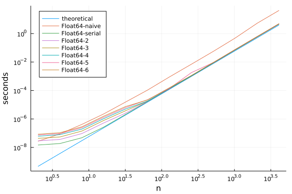
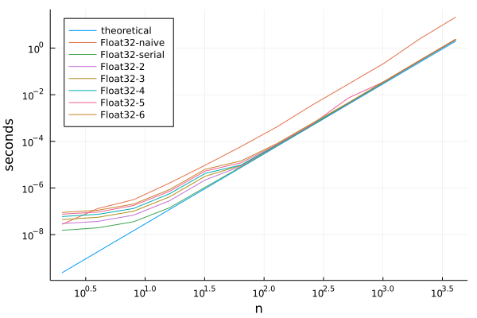

# TropicalGEMM

[](https://github.com/TensorBFS/TropicalGEMM.jl/actions)
[](https://codecov.io/gh/TensorBFS/TropicalGEMM.jl)

The fastest tropical matrix multiplication in the world!

## See the discussion here

https://github.com/JuliaSIMD/LoopVectorization.jl/issues/201

## Get started

Open a Julia REPL and type `]` to enter the `pkg>` mode, and then install related packages with
```julia
pkg> add TropicalNumbers, Octavian, TropicalGEMM, BenchmarkTools
```

In a julia REPL, you can try a minimum working example
```julia
julia> using TropicalNumbers, Octavian, TropicalGEMM, BenchmarkTools

julia> a = Tropical.(randn(1000, 1000))

julia> @benchmark Octavian.matmul_serial($a, $a)
```

## Benchmarks

Matrix size `n x n`, CPU Intel(R) Core(TM) i5-10400 CPU @ 2.90GHz.
The benchmark and plotting scripts could be found in the benchmarks folder.





## Warnings

It is expected to have an ambiguity error when one uses both `TropicalGEMM` and `CUDA`.
If you see these errors, please include `example/cudapatch.jl` in your project.
